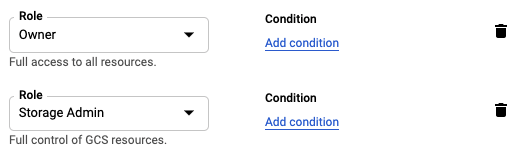
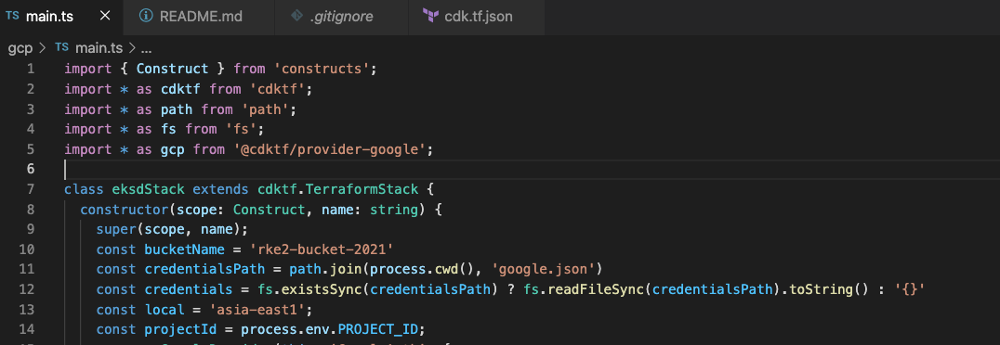
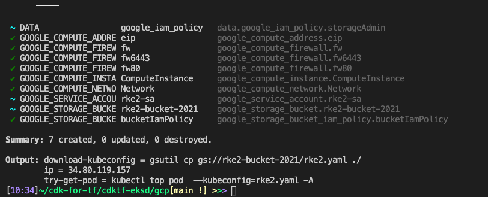
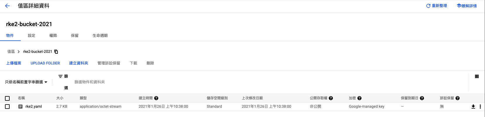
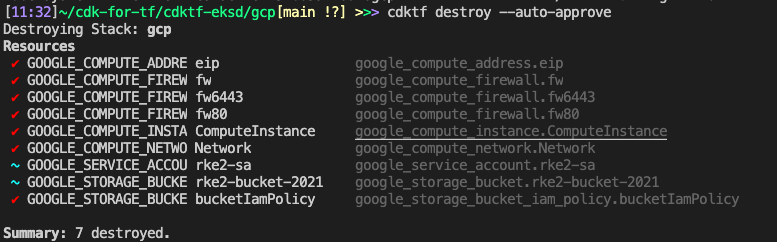

# CDKTF-EKSD
This resembles the example for the Google Cloud at [Hashicorp Learn](https://learn.hashicorp.com/terraform/gcp/build)

## Usage

Install project dependencies

```shell
yarn install
```

Generate CDK for Terraform constructs for Terraform provides and modules used in the project.

```bash
cdktf get
```

You can now edit the `main.ts` file if you want to modify any code.

Make sure to create your credential file `google.json` to make this example usable.

Generate Terraform configuration

```bash
cdktf synth
```

The above command will create a folder called `cdktf.out` that contains all Terraform JSON configuration that was generated.

See changes `cdktf diff` and deploy via `cdktf deploy`.

When you're done run `cdktf destroy`.

You need 
- `GCP project ID`
- `google.json` store your `credentials`, please create service account [see](https://cloud.google.com/iam/docs/creating-managing-service-accounts), and creating managing service account keys [see](https://cloud.google.com/iam/docs/creating-managing-service-account-keys) 
- service account need give permissions  `Owner`,`Storage Admin`
  


```bash
export PROJECT_ID=${projects-id-xxxxx}
```
*You should give your bucket a new name in `mian.ts` `const bucketName = 'your-shoud-rename-here'`*


### To deploy

```bash
cdktf deploy --auto-approve
```
After you will get server ip, and download kubeconfig cmd.


Waiting for your bucket create and rke2.yaml exists.
Because the bucket must be unique id in this world,
So you should give your bucket a new name in `mian.ts` `const bucketName = 'your-shoud-rename-here'`


### try download `rke2.yaml`
```bash
gsutil cp gs://${bucketName}/rke2.yaml ./
```

### get the pod 
```bash
kubectl top pod  --kubeconfig=rke2.yaml -A
```

### To destroy
```bash
cdktf destroy --auto-approve
```
